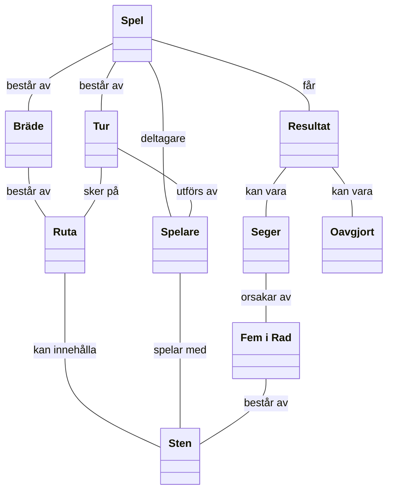

# 5. Begreppsmodell
Modellen beskriver verksamhetens viktigaste begrepp och visualiserar relationer mellan de med hjälp av klassdiagram.

## 5.1 Klassdiagram

## 5.2 Ordlista

##### Bräde
Spelplan där spelet genomförs

##### Fem i rad
vinstvillkoret uppfylls när fem stenar är placerade i rad, horisontellt, vertikalt, eller diagonalt  

##### Oavgjort
Matchen där ingen av spelare kunde placera 5 stenar i rad

##### Resultat
Slutliga tillstånd av spelet

##### Ruta
Unik punkt på brädet som man kan placera sten på

##### Seger
Match som slutade med en spelare som placerade 5 stenar i rad

##### Spel
Spel är en enskild spelomgång av Gomoku

##### Spelare
Aktor som agerar i spelet

##### Sten
Spelmärke som spelare placerar i rutor

##### Tur
En Handling i spelomgång
